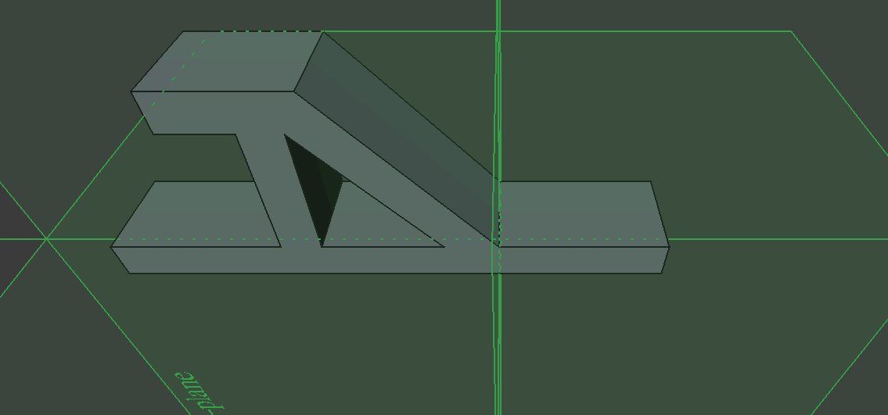
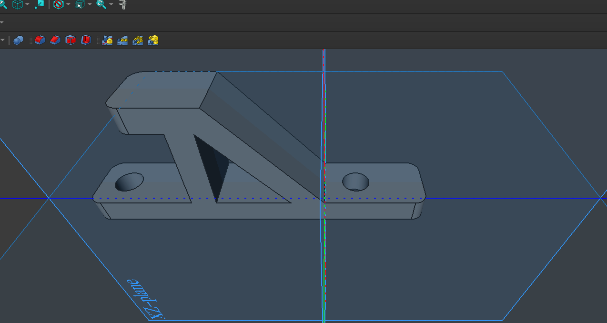
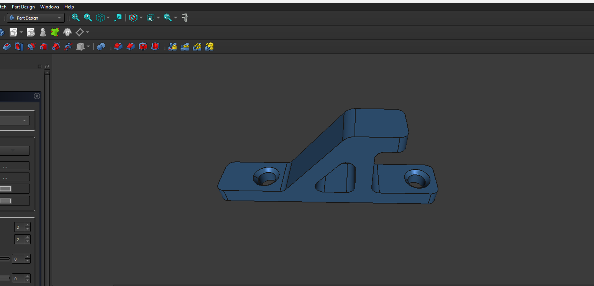
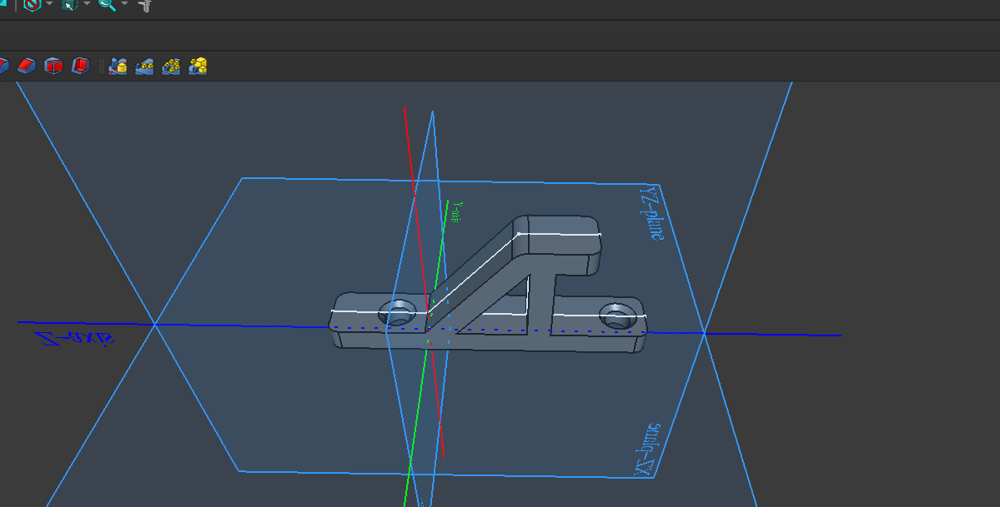
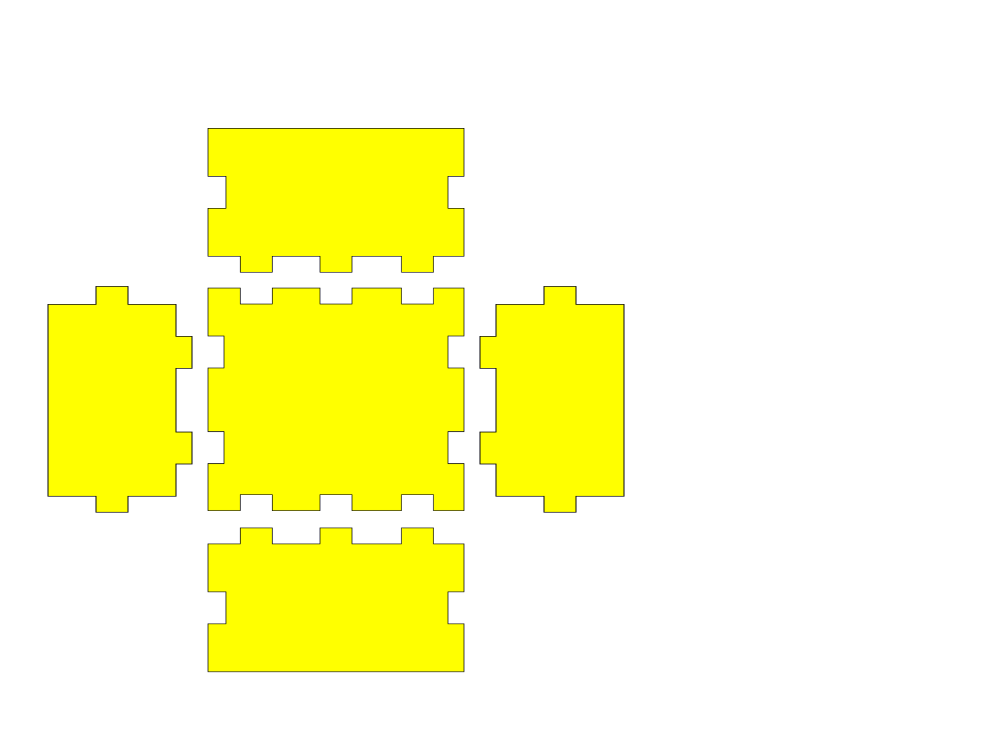
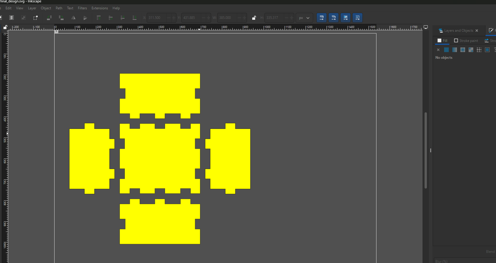

# 2. Activity of Day 2

## Digital Modeling for Fabrication

I created a parametric 3D CAD model of the CO3 nameplate in FreeCAD, establishing the precise geometry for all subsequent fabrication steps.

#### Activity 1: Parametric Base & Sketch Development

I created the base geometry using a parametric ellipse (150mm × 90mm) with 10mm extrusion. I then developed detailed sketches for the letter geometry, iterating through multiple design approaches to achieve optimal proportions.

#### Activity 2: Final Design & Verification

I finalized the design, verifying all critical dimensions: oval 150×90mm, base 10mm thick, letter depth 4mm, and corner radii 2mm for tool clearance. The design uses a 4mm pocket operation for letter carving.

#### Activity 3: Export & Format Conversion

I exported the model in multiple formats for downstream fabrication: STEP (for CNC milling), STL (for 3D printing prototype), and DXF (for laser-cut template validation). Each format was verified to maintain dimensional accuracy and fabrication constraints.

## Additional Links

- [Previous: 1. Activity of Day 1](day_1.md)
- [3. Activity of Day 3](day_3.md)
- [4. Activity of Day 4](day_4.md)
- [5. Activity of Day 5](day_5.md)
- [6. Activity of Day 6](day_6.md)
- [7. Activity of Day 7](day_7.md)
- [8. Activity of Day 8](day_8.md)
- [9. Activity of Day 9](day_9.md)
- [Next: 3. Activity of Day 3](day_3.md)
