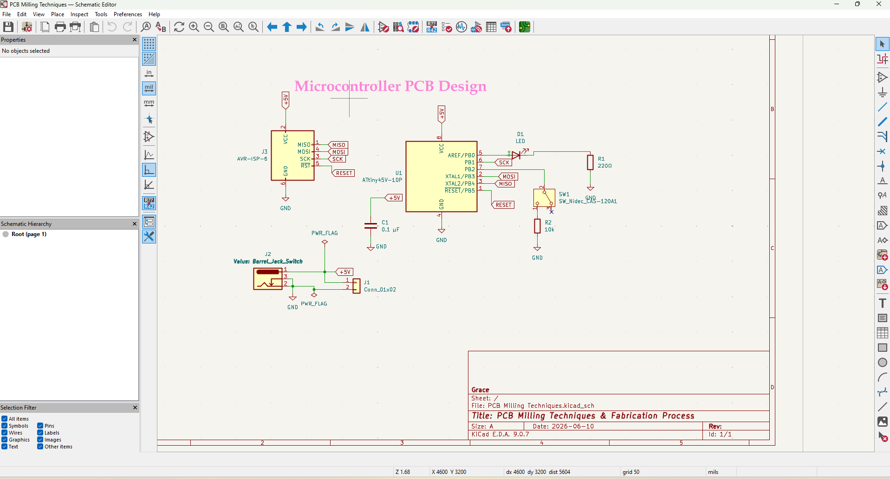
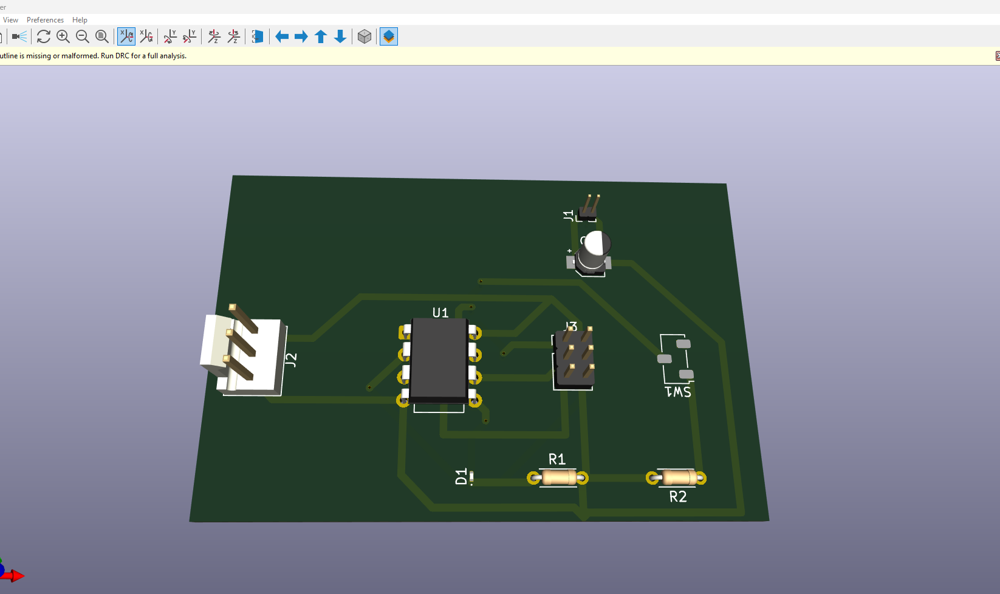
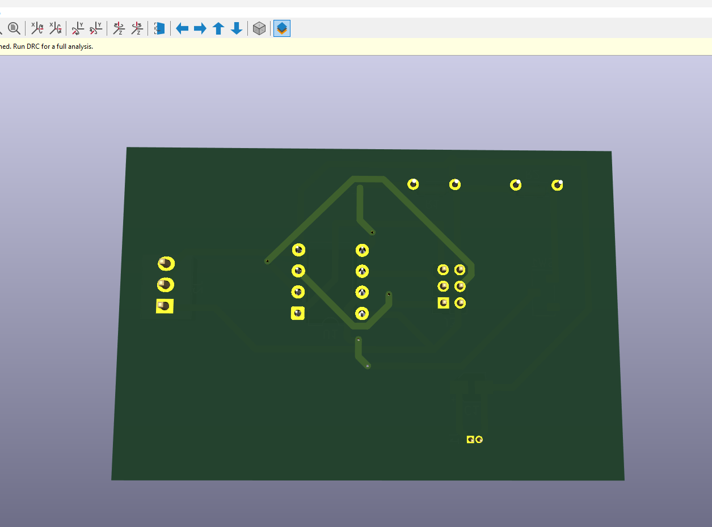
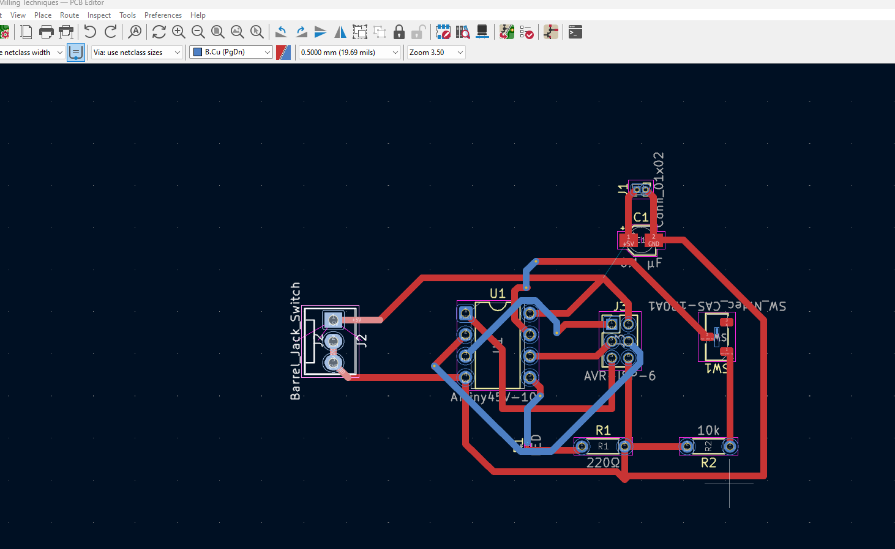

# 3. Activity of Day 3

## Technical Documentation & Quality Control Planning

I created comprehensive technical documentation for the CO3 nameplate project, including detailed engineering drawings, dimensional specifications, and quality control inspection plans to ensure fabrication accuracy throughout the manufacturing process.

#### Activity 1: Preliminary Design Verification

I verified all design specifications and constraints established on Day 2. This stage involved checking CAD model dimensions, confirming tool clearances (2mm radii for 4mm end mill), and preparing technical documentation packages for downstream fabrication activities.

#### Activity 2: Technical Drawing Development

I generated professional technical drawings including orthographic projections (top, front, side views), section views, and detailed dimensioning following industry engineering standards. All critical dimensions specified with tolerance callouts: ±0.1mm for letter depth, ±0.5mm for overall dimensions, and appropriate surface finish notes.

#### Activity 3: Quality Control Planning & Inspection Strategy

I developed a comprehensive quality control (QC) inspection checklist covering three phases: pre-fabrication verification (material and tooling checks), in-process monitoring (dimensional verification during machining), and post-fabrication final inspection (surface quality, tolerances, assembly fit). Measurement methods specified for each feature using calibrated instruments.

#### Activity 4: Bill of Materials & Cost Analysis

I compiled a complete bill of materials (BOM) including all components required for the project: raw materials (walnut hardwood blank), cutting tools (6mm and 4mm end mills, laser-cutting consumables), finishing supplies (progression sandpaper 120-400 grit, stain, polyurethane), and miscellaneous fasteners. Total estimated project cost calculated including material, tooling, and finishing materials.

!!! warning "Note: 3D Printing Not Performed"
    The 3D printing prototype validation step was not completed due to a **broken micro drill bit**. This required reassessment of prototype validation strategy. The prototype validation was instead addressed through laser-cut template verification on Day 5.

## Additional Links

- [Previous: 2. Activity of Day 2](day_2.md)
- [4. Activity of Day 4](day_4.md)
- [5. Activity of Day 5](day_5.md)
- [6. Activity of Day 6](day_6.md)
- [7. Activity of Day 7](day_7.md)
- [8. Activity of Day 8](day_8.md)
- [9. Activity of Day 9](day_9.md)
- [Next: 4. Activity of Day 4](day_4.md)

