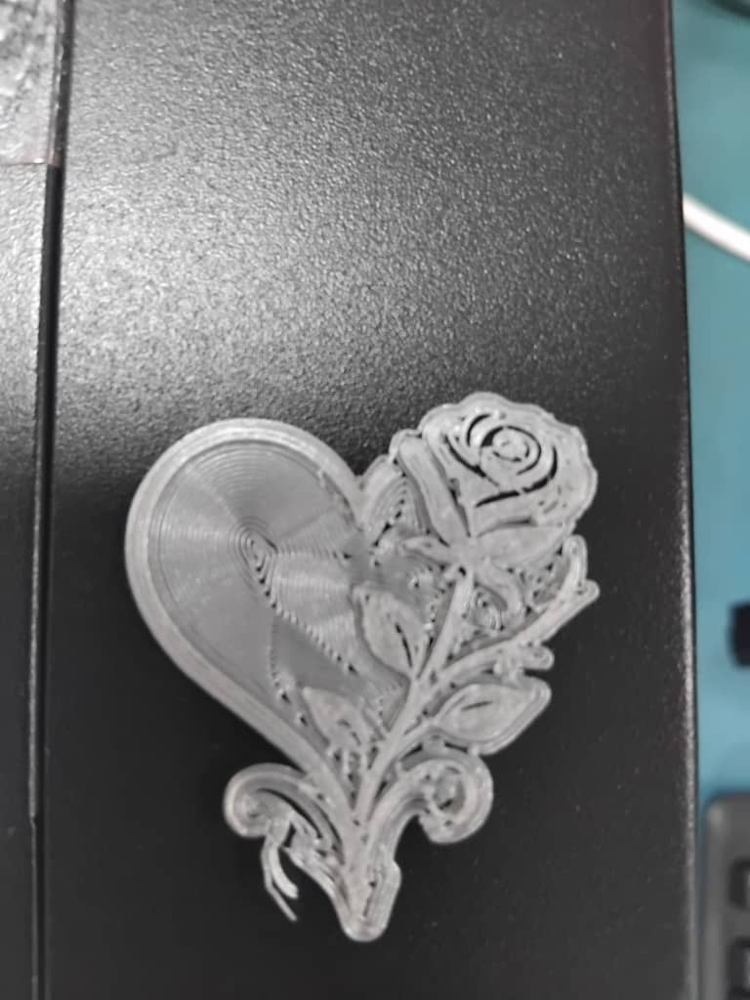

# 6. Activity of Day 6

## Digital Fabrication II: Additive Manufacturing

This session focused on additive manufacturing using an Ultimaker 3D printer. The goal was to prepare a digital model for printing, slice it in Cura, run the print, and inspect the final PLA prototype.

#### Overview

Additive manufacturing builds parts layer by layer from digital files. For Day 6, the process started with an STL model exported from CAD, then moved through slicing, printer preparation, and print quality inspection.

#### Preparing the Model for Printing

The CAD model was exported as an STL file and imported into Ultimaker Cura. The chosen print settings were:

- Layer height: 0.2 mm
- Infill: 20%
- Nozzle temperature: 205°C
- Bed temperature: 60°C
- Adhesion type: brim

After slicing, Cura generated the G-code for the Ultimaker printer.

#### Printing and Monitoring

The build plate was leveled, PLA filament was loaded, and the print started. The first layers adhered well, and the print progressed steadily with no visible failures.

#### Prototype Evaluation

After printing, the part was removed from the bed and the brim was trimmed. The printed object showed the expected FDM layer texture and the overall shape matched the original design.

#### Final Result

The completed prototype was evaluated for surface quality and dimensional accuracy. This prototype validated the 3D printing workflow before moving to the next fabrication stage.

#### What I learned

- How to prepare and slice a 3D model for a PLA print
- How to configure Ultimaker Cura print settings
- How to monitor a print job from start to finish
- How to inspect a printed prototype for quality and validation

## Additional Links

- [Previous: 5. Activity of Day 5](day_5.md)
- [Next: 7. Activity of Day 7](day_7.md)

